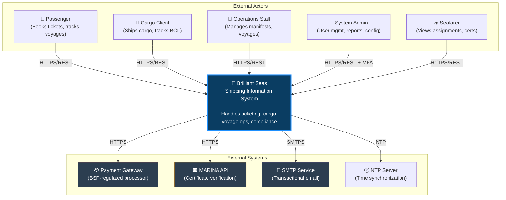
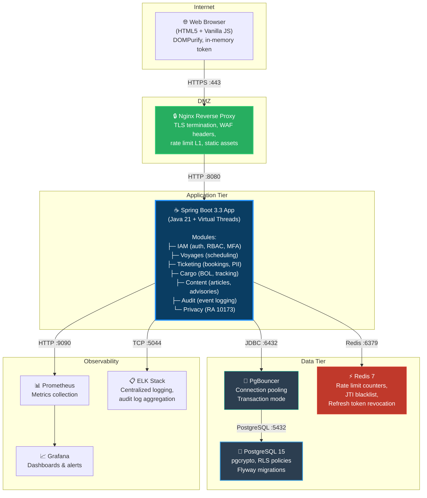

# Brilliant Seas Shipping Corporation — Architecture Document

**Document Version:** 1.0  
**Classification:** CONFIDENTIAL — Internal Use Only  
**Author:** Principal Solutions Architect  
**Date:** 2026-04-03  
**Status:** DRAFT — Pending Stakeholder Approval  

> *"Services that are truly Brilliant"*

---

## 1. Executive Summary

This document defines the complete system architecture for the Brilliant Seas Shipping Information System (BSSIS) — a production-grade, security-hardened web platform for Philippine domestic shipping operations. The system handles passenger ticketing, cargo management, voyage scheduling, regulatory compliance (MARINA), and data privacy obligations under RA 10173.

**Architecture Pattern:** Modular Monolith (extraction-ready modules)  
**Security Posture:** Zero Trust, defense-in-depth, OWASP Top 10 mitigated  
**Compliance:** RA 10173 (Data Privacy Act), MARINA ICT, BSP payment regulations  

---

## 2. C4 Model — Level 1: System Context

### System Context Boundaries

| Boundary | Trust Level | Protocol | Auth Mechanism |
|----------|-------------|----------|----------------|
| Browser → Nginx | Untrusted | TLS 1.3 | None (public) or JWT |
| Nginx → Spring Boot | Internal/Trusted | HTTP (loopback) | X-Forwarded headers |
| Spring Boot → PostgreSQL | Internal/Trusted | TLS + mTLS | DB credentials (Vault) |
| Spring Boot → Redis | Internal/Trusted | TLS | Password (env var) |
| Spring Boot → Payment GW | External/Untrusted | HTTPS | API Key + HMAC |
| Spring Boot → MARINA API | External/Untrusted | HTTPS | OAuth2 client credentials |
| Spring Boot → SMTP | External/Semi-trusted | SMTPS | SMTP auth |

---

## 3. C4 Model — Level 2: Container Diagram

### Container Responsibilities

| Container | Technology | Responsibility | Security Controls |
|-----------|-----------|----------------|-------------------|
| **Nginx** | nginx:alpine | TLS termination, security headers (CSP/HSTS/X-Frame), static file serving, L1 rate limiting | No upstream secrets, read-only config mount |
| **Spring Boot App** | Java 21, Spring Boot 3.3 | All business logic, authentication, authorization, API serving | Non-root user (1001), read-only filesystem, no secrets in image |
| **PgBouncer** | pgbouncer/pgbouncer | Connection pooling (transaction mode), max 100 client connections | No external port, internal network only |
| **PostgreSQL** | postgres:15 | Persistent storage, pgcrypto encryption, RLS enforcement, Flyway schema | No external port, encrypted at rest, WAL archiving |
| **Redis** | redis:7-alpine | Rate limit counters, JTI blacklist, refresh token revocation cache | Password required, no external port, no persistence (ephemeral) |
| **Prometheus** | prom/prometheus | Metrics scraping from /actuator/prometheus | Internal network only |
| **Grafana** | grafana/grafana | Metrics visualization, alerting | Admin password from Vault, internal access |
| **ELK** | elastic/elasticsearch + logstash + kibana | Centralized structured logging, audit log search | Internal network, index-level access control |

---

## 4. Spring Security Filter Chain Architecture

```mermaid
graph LR
    REQ["Incoming<br/>HTTP Request"] --> CORS["CorsFilter<br/>(Origin whitelist)"]
    CORS --> RL["RateLimitFilter<br/>(Bucket4j + Redis)<br/>→ 429 if exceeded"]
    RL --> CSRF["CsrfTokenFilter<br/>(Double-submit cookie)<br/>→ 403 if invalid"]
    CSRF --> JWT["JwtAuthFilter<br/>(RS256 verify)<br/>→ 401 if invalid"]
    JWT --> RLS["RlsContextFilter<br/>(SET LOCAL app.*)"]
    RLS --> AUTH["Spring Security<br/>Authorization<br/>→ 403 if denied"]
    AUTH --> CTRL["Controller<br/>(@PreAuthorize)"]
    CTRL --> SVC["Service Layer"]

    style REQ fill:#e74c3c,stroke:#c0392b,color:#fff
    style RL fill:#f39c12,stroke:#e67e22,color:#fff
    style JWT fill:#3498db,stroke:#2980b9,color:#fff
    style AUTH fill:#27ae60,stroke:#219a52,color:#fff
    style CTRL fill:#0a3d62,stroke:#1e90ff,color:#fff
```

### Filter Chain Design Rationale

| Order | Filter | Why This Position |
|-------|--------|-------------------|
| 1 | **CorsFilter** | Reject disallowed origins before any processing |
| 2 | **RateLimitFilter** | Shed excess load BEFORE expensive JWT parsing (DoS mitigation) |
| 3 | **CsrfTokenFilter** | Validate CSRF on state-changing requests before auth processing |
| 4 | **JwtAuthFilter** | Parse and validate JWT, populate SecurityContext |
| 5 | **RlsContextFilter** | Set PostgreSQL session variables for RLS enforcement |
| 6 | **Spring Authorization** | Evaluate URL-pattern and method-level access rules |

> **Design Decision:** RateLimitFilter is placed BEFORE JwtAuthFilter (contrary to the user spec which had CSRF first). Rationale: JWT parsing involves cryptographic verification (RS256 signature check) which is CPU-intensive. Rate limiting must shed malicious traffic before incurring this cost. This prevents a class of computational DoS attacks where an attacker submits syntactically valid but malicious tokens at high volume.
