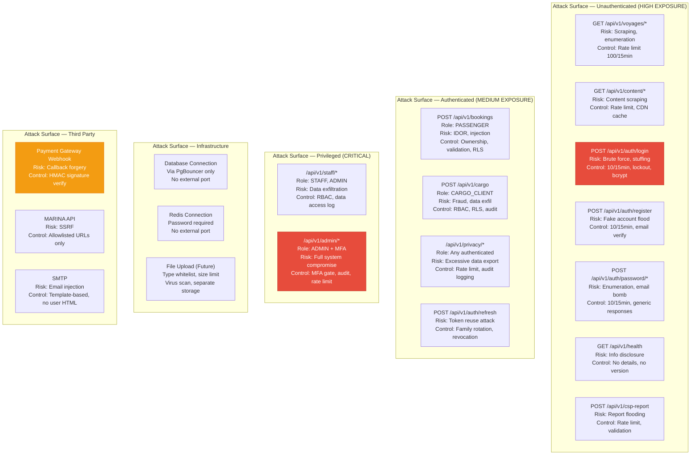

# STRIDE Threat Model — Brilliant Seas Shipping Information System

**Document:** Architecture Document — Section 5  
**Methodology:** STRIDE per-asset analysis  
**Risk Rating:** Impact × Likelihood (H/M/L)  

---

## 5. STRIDE Threat Model

### 5.1 Asset Inventory

| ID | Asset | Classification | Regulatory Scope |
|----|-------|---------------|------------------|
| A1 | Passenger PII (name, govt ID, DOB, contact) | CONFIDENTIAL — Personal Information | RA 10173 §3(g), §16 |
| A2 | Cargo manifest & declared values | CONFIDENTIAL — Commercial | Maritime Industry Auth |
| A3 | Payment transaction references | CONFIDENTIAL — Financial | BSP Circular 1033 |
| A4 | Vessel voyage operational data | INTERNAL | MARINA reporting |
| A5 | User credentials & session tokens | SECRET | OWASP, ISO 27001 A.9 |
| A6 | Seafarer employment & certificates | CONFIDENTIAL — Personal/Regulated | RA 10173, MARINA STCW |
| A7 | Admin panel & privileged access | SECRET | ISO 27001 A.9.2 |

---

### 5.2 STRIDE Analysis by Asset

#### A1: Passenger PII

| Threat | Category | Risk | Attack Scenario | Mitigation | Control ID |
|--------|----------|------|-----------------|------------|------------|
| Attacker impersonates passenger to view/modify PII | **Spoofing** | H | Stolen JWT used to access booking details | JWT RS256 with 15-min expiry; booking ownership check in service layer; refresh token family rotation | SC-01 |
| Attacker modifies passenger records via API | **Tampering** | H | IDOR — changing passenger_id in request | UUID v4 PKs (non-guessable); booking ownership validation; input validation via Jakarta Bean Validation | SC-02 |
| Passenger denies making a booking | **Repudiation** | M | Chargeback dispute with no evidence | Immutable audit_log (INSERT-only DB role); BOOKING_CREATED event with IP, timestamp, session_id, correlation_id | SC-03 |
| PII leaked via API response, logs, or error messages | **Info Disclosure** | H | Stack trace exposes passenger name; response includes unmasked govt ID | pgcrypto column encryption (id_number, mobile_no); PII masking in API responses; GlobalExceptionHandler strips internals; structured logging with PII scrubbing | SC-04 |
| Enumeration of passenger lookup endpoint | **DoS** | M | Brute-force booking references | Rate limiting (PASSENGER_API: 300 req/15min); UUIDs (not sequential); booking_ref is random alphanumeric | SC-05 |
| Regular user accesses other passengers' data | **EoP** | H | Horizontal privilege escalation via modified booking_id | PostgreSQL RLS (passenger_self policy); service-layer ownership check; @PreAuthorize with principal binding | SC-06 |

#### A2: Cargo Manifest & Declared Values

| Threat | Category | Risk | Attack Scenario | Mitigation | Control ID |
|--------|----------|------|-----------------|------------|------------|
| Unauthorized party creates cargo booking | **Spoofing** | M | Attacker with stolen CARGO_CLIENT credentials | JWT auth + role check; MFA recommended for high-value shipments | SC-07 |
| Modify declared values after BOL issued | **Tampering** | H | Shipper inflates insurance claim by altering declared_value | BOL status workflow (DRAFT→ISSUED is irreversible); audit trail with old_value/new_value JSONB; DB trigger prevents UPDATE on issued BOL | SC-08 |
| Shipper denies cargo contents or booking | **Repudiation** | H | Dispute over cargo damage liability | CARGO_BOOKING_CREATED + BOL_ISSUED audit events; full state capture; digitally timestamped records | SC-09 |
| Competitor discovers cargo details | **Info Disclosure** | M | Broken access control exposes other shippers' data | RLS policy (shipper sees own cargo only); consignee_contact encrypted with pgcrypto | SC-10 |
| Flood cargo booking endpoint | **DoS** | M | Automated submissions exhaust system resources | CARGO_API rate limit (200 req/15min per userId); request payload size limit (100KB) | SC-11 |
| Cargo client accesses admin cargo reports | **EoP** | M | Client attempts to access /api/v1/admin/reports | RBAC + @PreAuthorize("hasRole('ADMIN')"); separate admin endpoint group | SC-12 |

#### A3: Payment Transaction References

| Threat | Category | Risk | Attack Scenario | Mitigation | Control ID |
|--------|----------|------|-----------------|------------|------------|
| Attacker submits forged payment confirmation | **Spoofing** | H | Crafted webhook to mark booking as PAID | Server-side payment verification via gateway API; webhook HMAC signature validation; idempotency keys | SC-13 |
| Modify payment amount post-confirmation | **Tampering** | H | SQL injection to alter total_amount | Payment amount computed server-side from fare_class + passenger count; JPA parameterized queries; amount immutable after CONFIRMED status | SC-14 |
| Payment dispute without evidence | **Repudiation** | H | Chargeback with no booking trail | Audit log correlates booking_id + payment gateway reference + timestamp; gateway transaction ID stored | SC-15 |
| Payment reference numbers leaked | **Info Disclosure** | M | API response includes full payment gateway reference | Payment refs masked in responses (show last 4 chars only); no payment data in URL params | SC-16 |
| Payment endpoint abuse | **DoS** | M | Automated payment attempts | AUTH_ENDPOINTS rate limit; CAPTCHA on payment initiation (future); amount validation before gateway call | SC-17 |
| User marks own booking as PAID | **EoP** | H | Direct API call to update payment_status | payment_status only writable by SYSTEM (gateway callback handler) or STAFF role; @PreAuthorize enforced | SC-18 |

#### A4: Vessel Voyage Operational Data

| Threat | Category | Risk | Attack Scenario | Mitigation | Control ID |
|--------|----------|------|-----------------|------------|------------|
| Unauthorized schedule modification | **Spoofing** | H | Attacker creates fake voyages to defraud passengers | ADMIN role + MFA required for all voyage CRUD operations | SC-19 |
| Alter departure times or capacity | **Tampering** | H | Staff inflates passenger_cap for overbooking | Audit trail on all voyage mutations; VOYAGE_STATUS_UPDATED event; admin approval workflow for capacity changes | SC-20 |
| Admin denies schedule change | **Repudiation** | M | Incorrect departure time causes missed sailing | Every voyage mutation logged with actor_id, old/new values, timestamp | SC-21 |
| Internal remarks exposed to passengers | **Info Disclosure** | L | API returns voyage.remarks to public endpoint | Response DTO excludes internal fields; MapStruct mapper applies role-based field selection | SC-22 |
| Scraping voyage schedules | **DoS** | M | Competitor scrapes all route/schedule data | PUBLIC_SEARCH rate limit (100 req/15min per IP); no bulk export endpoint for public | SC-23 |
| Staff creating voyages (admin-only) | **EoP** | M | STAFF role user accesses POST /api/v1/admin/voyages | Endpoint requires ADMIN role; @PreAuthorize("hasRole('ADMIN') and @mfaService.isVerified(authentication)") | SC-24 |

#### A5: User Credentials & Session Tokens

| Threat | Category | Risk | Attack Scenario | Mitigation | Control ID |
|--------|----------|------|-----------------|------------|------------|
| Credential stuffing / brute force | **Spoofing** | H | Automated login with breached credential lists | Account lockout (5 attempts → 15min, exponential to 1hr); bcrypt cost 12; HaveIBeenPwned check; AUTH rate limit (10 req/15min) | SC-25 |
| JWT modification / forging | **Tampering** | H | Attacker alters role claim in JWT payload | RS256 asymmetric signing (private key server-only); signature verification on every request; no HS256 fallback | SC-26 |
| Deny login activity | **Repudiation** | M | User denies unauthorized access from their account | USER_LOGIN_SUCCESS/FAILED events with IP, User-Agent, timestamp; login notification email | SC-27 |
| Password hash or token theft | **Info Disclosure** | H | Database breach exposes password_hash column | bcrypt (one-way, cost 12); access tokens in memory only (never localStorage); refresh tokens in HttpOnly/Secure/SameSite=Strict cookies | SC-28 |
| Login endpoint flooding | **DoS** | H | DDoS on /api/v1/auth/login | AUTH_ENDPOINTS rate limit (10 req/15min per IP); Nginx L1 rate limiting; connection limits | SC-29 |
| Self-elevation of role | **EoP** | H | User manipulates registration to gain ADMIN role | Role defaults to PASSENGER on registration; role changes require SUPERADMIN + MFA; DB CHECK constraint on role column | SC-30 |

#### A6: Seafarer Employment & Certificates

| Threat | Category | Risk | Attack Scenario | Mitigation | Control ID |
|--------|----------|------|-----------------|------------|------------|
| Fake seafarer credential submission | **Spoofing** | H | Fraudulent STCW certificates uploaded | MARINA API certificate verification (future); admin-only record creation; document hash verification | SC-31 |
| Modify certification expiry dates | **Tampering** | H | Extend expired certificates to maintain employment | Audit trail with full diff; ADMIN-only mutations; DB-level UPDATE trigger logs to audit_log | SC-32 |
| Deny employment history changes | **Repudiation** | M | Disputed employment record modifications | Full audit log with old_value/new_value JSONB and actor attribution | SC-33 |
| Seafarer PII exposure | **Info Disclosure** | H | Unauthorized access to seafarer personal data | pgcrypto encryption on sensitive fields; RLS; data access logging (data_access_log); RA 10173 compliance | SC-34 |
| Bulk seafarer data extraction | **DoS/Exfiltration** | M | Automated scraping of seafarer records | Pagination limits (max 50 per page); STAFF_API rate limit; no bulk export without ADMIN + MFA | SC-35 |
| Seafarer modifying own certification status | **EoP** | M | SEAFARER role attempts to update own cert validity | SEAFARER role = read-only on own records; mutations require STAFF/ADMIN; @PreAuthorize enforced | SC-36 |

#### A7: Admin Panel & Privileged Access

| Threat | Category | Risk | Attack Scenario | Mitigation | Control ID |
|--------|----------|------|-----------------|------------|------------|
| Attacker gains admin access | **Spoofing** | H | Phishing/social engineering to obtain admin credentials | MFA required for ALL admin operations; strong password policy (Passay: 12+ chars); 90-day password rotation for STAFF/ADMIN | SC-37 |
| Admin modifies audit logs | **Tampering** | H | Cover tracks after unauthorized action | audit_log table: audit_writer DB role has INSERT-ONLY (no UPDATE, no DELETE); table permissions enforced at PostgreSQL level | SC-38 |
| Admin denies administrative action | **Repudiation** | M | Admin claims they didn't change user roles | ADMIN_ROLE_CHANGED event; all admin actions logged with correlation_id; MFA verification timestamp captured | SC-39 |
| Admin panel exposes system internals | **Info Disclosure** | M | Error responses reveal stack traces, DB schema | GlobalExceptionHandler: generic messages in production; health endpoint show-details=never; no version headers | SC-40 |
| Admin panel targeted for DoS | **DoS** | M | Concentrated attack on admin endpoints | ADMIN_API rate limit (200 req/15min); separate endpoint group; Nginx connection limiting | SC-41 |
| Staff escalating to admin | **EoP** | H | STAFF role user attempts admin operations | Role changes require SUPERADMIN only; DB CHECK constraint; MFA gate on role elevation; audit event emitted | SC-42 |

---

### 5.3 Attack Surface Map

### 5.4 Threat Heatmap Summary

| Asset | S | T | R | I | D | E | Overall Risk |
|-------|---|---|---|---|---|---|-------------|
| A1: Passenger PII | 🔴 | 🔴 | 🟡 | 🔴 | 🟡 | 🔴 | **CRITICAL** |
| A2: Cargo Manifest | 🟡 | 🔴 | 🔴 | 🟡 | 🟡 | 🟡 | **HIGH** |
| A3: Payment Refs | 🔴 | 🔴 | 🔴 | 🟡 | 🟡 | 🔴 | **CRITICAL** |
| A4: Voyage Data | 🔴 | 🔴 | 🟡 | 🟢 | 🟡 | 🟡 | **HIGH** |
| A5: Credentials/Tokens | 🔴 | 🔴 | 🟡 | 🔴 | 🔴 | 🔴 | **CRITICAL** |
| A6: Seafarer Records | 🔴 | 🔴 | 🟡 | 🔴 | 🟡 | 🟡 | **HIGH** |
| A7: Admin Access | 🔴 | 🔴 | 🟡 | 🟡 | 🟡 | 🔴 | **CRITICAL** |

🔴 HIGH &nbsp; 🟡 MEDIUM &nbsp; 🟢 LOW
