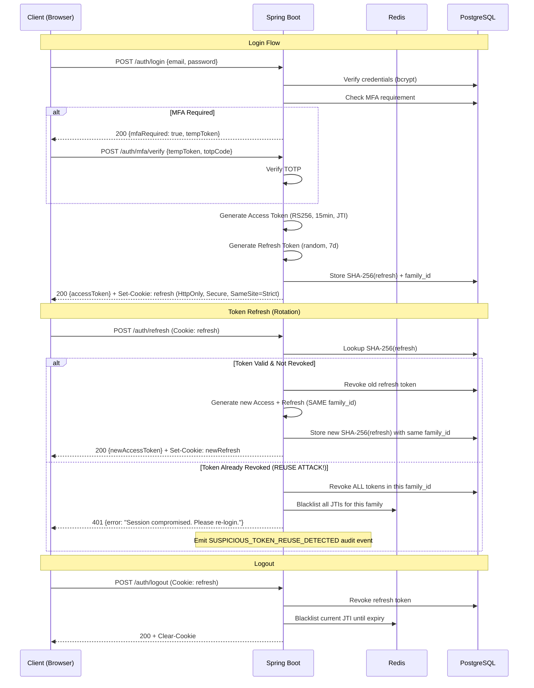

# Security Control Matrix & OWASP Top 10 Mapping

**Document:** Architecture Document — Section 6  

---

## 6. Security Control Matrix — OWASP Top 10 (2021) Mapping

### A01:2021 — Broken Access Control

| Control | Implementation | Layer | STRIDE Ref |
|---------|---------------|-------|------------|
| RBAC with fine-grained permissions | `role_permissions` table; `@PreAuthorize` on every service method | Application | SC-06, SC-12, SC-24, SC-36 |
| Row-Level Security | PostgreSQL RLS policies on `passengers`, `bookings`, `cargo_bookings` | Database | SC-06, SC-10 |
| Ownership validation | Service-layer check: `booking.bookedBy == principal.userId` | Application | SC-01, SC-06 |
| CORS whitelist | `CorsConfig.java` — only production domain allowed; no wildcard | Network | — |
| JWT claim validation | Role/permissions validated from JWT claims on every request | Application | SC-26, SC-30 |
| MFA gate on admin operations | `@mfaService.isVerified(authentication)` in `@PreAuthorize` | Application | SC-37, SC-42 |

### A02:2021 — Cryptographic Failures

| Control | Implementation | Layer | STRIDE Ref |
|---------|---------------|-------|------------|
| PII encryption at rest | `pgcrypto pgp_sym_encrypt` via `PiiEncryptionConverter` | Database | SC-04, SC-34 |
| Password hashing | bcrypt cost factor 12 via Spring Security's `BCryptPasswordEncoder` | Application | SC-25, SC-28 |
| JWT signing | RS256 (asymmetric) — private key in Vault/Docker secret; no HS256 fallback | Application | SC-26 |
| TLS everywhere | TLS 1.3 on Nginx; `ssl-mode: verify-full` on JDBC; SMTPS for email | Network | SC-28 |
| No secrets in code/config | All secrets from environment variables / Docker secrets / Vault | Infrastructure | SC-28, SC-40 |
| Refresh token hashing | SHA-256 hash stored in DB; raw token only in HttpOnly cookie | Application | SC-28 |

### A03:2021 — Injection

| Control | Implementation | Layer | STRIDE Ref |
|---------|---------------|-------|------------|
| Parameterized queries | Spring Data JPA / Hibernate — no string concatenation in queries | Database | SC-14 |
| Input validation | Jakarta Bean Validation on all DTOs; regex patterns on IDs, names, dates | Application | SC-02 |
| Output encoding | JSON responses only (`Content-Type: application/json`); no HTML rendering server-side | Application | SC-04 |
| DOMPurify | Client-side HTML sanitization for any dynamic rendering | Frontend | — |
| No native SQL without `@Query` | All repository methods use JPA criteria or `@Query` with named parameters | Application | SC-14 |

### A04:2021 — Insecure Design

| Control | Implementation | Layer | STRIDE Ref |
|---------|---------------|-------|------------|
| STRIDE threat model | This document — analyzed before any architecture/code decisions | Design | All |
| Defense in depth | Security at every layer: Nginx → Filter chain → Service → Repository → Database | Architecture | All |
| Secure defaults | `ddl-auto: validate`; `show-details: never`; CSRF enabled; HSTS preloaded | Configuration | SC-40 |
| Business logic security | Payment amounts computed server-side; status transitions validated; BOL immutability | Application | SC-08, SC-14, SC-18 |
| Rate limiting tiers | Different limits per endpoint sensitivity; 7 defined tiers | Application | SC-05, SC-17, SC-29 |

### A05:2021 — Security Misconfiguration

| Control | Implementation | Layer | STRIDE Ref |
|---------|---------------|-------|------------|
| Security headers | CSP, HSTS, X-Frame-Options: DENY, X-Content-Type-Options, Referrer-Policy | Nginx + Spring | SC-40 |
| No default credentials | All passwords from Vault/env; no default admin account | Infrastructure | SC-37 |
| Error handling | `GlobalExceptionHandler` — generic messages; correlationId for tracing | Application | SC-40 |
| Health endpoint | `show-details: never`; no version/technology exposure | Configuration | SC-40 |
| Docker hardening | Non-root user; read-only filesystem; no ext ports on DB/Redis | Infrastructure | SC-40, SC-41 |
| Flyway validation | `validate-on-migrate: true`; checksum verification on all migrations | Database | SC-38 |

### A06:2021 — Vulnerable and Outdated Components

| Control | Implementation | Layer | STRIDE Ref |
|---------|---------------|-------|------------|
| Dependency version pinning | All Maven dependencies with exact versions in `pom.xml` | Build | — |
| SCA scanning | OWASP Dependency-Check Maven plugin in CI/CD pipeline | Build | — |
| Java 21 LTS | Long-term support with security patches; virtual threads for performance | Runtime | — |
| SRI hashes | Subresource Integrity on all CDN-loaded scripts (DOMPurify, fonts) | Frontend | — |

### A07:2021 — Identification and Authentication Failures

| Control | Implementation | Layer | STRIDE Ref |
|---------|---------------|-------|------------|
| Password policy | Passay: 12+ chars, upper/lower/digit/special, no common passwords | Application | SC-25 |
| HaveIBeenPwned check | k-anonymity (first 5 SHA1 chars) breach check on registration + password change | Application | SC-25 |
| Account lockout | 5 failed attempts → 15min lock (exponential to 1hr) | Application | SC-25, SC-29 |
| MFA (TOTP) | Google Authenticator compatible; required for ADMIN/SUPERADMIN roles | Application | SC-37 |
| Password rotation | 90-day expiry for STAFF/ADMIN roles; enforced at login | Application | SC-37 |
| Refresh token rotation | Every refresh issues new pair; family tracking detects reuse attacks | Application | SC-26, SC-28 |
| Email verification | Registration requires email verification before account activation | Application | SC-30 |

### A08:2021 — Software and Data Integrity Failures

| Control | Implementation | Layer | STRIDE Ref |
|---------|---------------|-------|------------|
| JWT RS256 signing | Asymmetric keys — only server can sign; any party can verify | Application | SC-26 |
| Flyway migration checksums | Tamper detection on all migration scripts | Database | SC-38 |
| SRI on CDN resources | Hash verification on external JavaScript/CSS | Frontend | — |
| Webhook HMAC verification | Payment gateway callback signature validation | Application | SC-13 |
| Audit log immutability | INSERT-only DB role; no application path for UPDATE/DELETE | Database | SC-38 |

### A09:2021 — Security Logging and Monitoring Failures

| Control | Implementation | Layer | STRIDE Ref |
|---------|---------------|-------|------------|
| Comprehensive audit events | 20+ event types covering all mutations and security events | Application | SC-03, SC-09, SC-15, SC-21 |
| Async event publishing | Spring `@EventListener` + `@Async` — audit never blocks business logic | Application | — |
| Structured logging | JSON-formatted logs shipped to ELK; correlation_id on every request | Infrastructure | SC-40 |
| PII access logging | `data_access_log` table — who accessed what PII, when, why, legal basis | Application/DB | SC-34 |
| Alerting | Grafana alerts on: failed login spikes, rate limit hits, token reuse detection | Observability | SC-27, SC-29 |
| Tamper-proof audit | audit_writer DB role; log shipping to immutable storage | Database | SC-38 |

### A10:2021 — Server-Side Request Forgery (SSRF)

| Control | Implementation | Layer | STRIDE Ref |
|---------|---------------|-------|------------|
| Allowlisted external URLs | Only MARINA API base URL and payment gateway URL configurable | Application | — |
| No user-controlled URLs | No endpoint accepts URL as input for server-side fetching | Application | — |
| DNS rebinding protection | External calls via HTTP client with connection timeout + host validation | Application | — |

---

## 7. JWT Token Lifecycle & Family Rotation

### Token Design Decisions

| Decision | Rationale |
|----------|-----------|
| **RS256 over HS256** | Asymmetric signing: only auth module needs private key. When extracting to microservices, other services verify with public key only. Eliminates shared-secret risk. |
| **15-minute access token** | Balance between security (short window if stolen) and UX (not too frequent refresh). Industry standard for financial-adjacent applications. |
| **Family-based rotation** | Detects token theft: if attacker and legitimate user both try to use rotated tokens, the reuse triggers family-wide revocation. Without families, a stolen refresh token goes undetected. |
| **JTI blacklisting in Redis** | Access tokens are stateless by design, but we need the ability to revoke compromised ones before expiry. Redis provides O(1) lookup with automatic TTL expiry matching token lifetime. |
| **HttpOnly + Secure + SameSite=Strict** | HttpOnly: inaccessible to JavaScript (XSS-proof). Secure: HTTPS only. SameSite=Strict: prevents CSRF via cross-site requests. Triple defense on refresh cookie. |
| **Access token in memory (not localStorage)** | localStorage is accessible to any XSS payload. Module-scoped variable survives page navigation but clears on tab close — acceptable security trade-off. |
