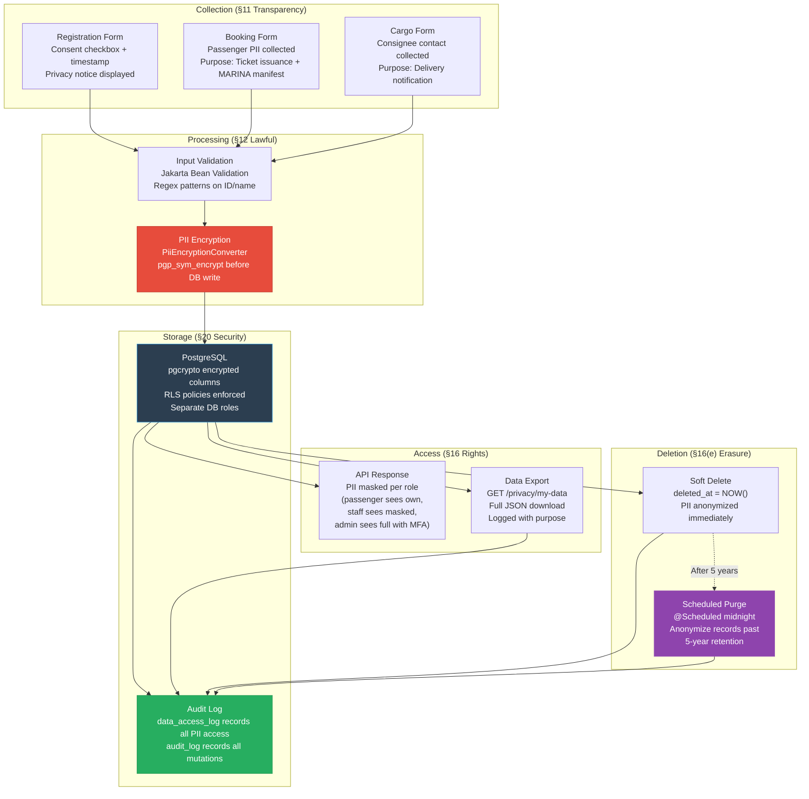

# RA 10173 (Data Privacy Act) Compliance Checklist

**Document:** Architecture Document — Section 8  
**Regulation:** Republic Act No. 10173 — Data Privacy Act of 2012  
**Implementing Rules:** NPC Circular 16-01, 16-02, 16-03  
**System:** Brilliant Seas Shipping Information System (BSSIS)  

---

## 8. RA 10173 Compliance Matrix

### 8.1 Data Inventory — Personal Information Processed

| Data Element | Data Subject | Classification | Storage | Encryption | Retention | Legal Basis |
|-------------|-------------|----------------|---------|------------|-----------|-------------|
| Full Name (first, middle, last) | Passenger | Personal Information | `passengers.first_name`, `last_name`, `middle_name` | Plaintext (not sensitive per se, but access-controlled) | 5 years (maritime law) | Contract performance (§12a) |
| Birth Date | Passenger | Personal Information | `passengers.birth_date` | Plaintext | 5 years | Legal obligation — senior/minor fare validation |
| Government ID Number | Passenger | Sensitive Personal Info | `passengers.id_number` | **pgp_sym_encrypt (pgcrypto)** | 5 years, then anonymized | Legal obligation — MARINA passenger manifest |
| Government ID Type | Passenger | Personal Information | `passengers.id_type` | Plaintext | 5 years | Legal obligation |
| Mobile Number | User | Personal Information | `users.mobile_no` | **pgp_sym_encrypt (pgcrypto)** | Until account deletion | Consent (§12a) |
| Email Address | User | Personal Information | `users.email` | Plaintext (indexed for login) | Until account deletion | Contract performance |
| Password Hash | User | Credentials (not PII per se) | `users.password_hash` | bcrypt (one-way hash, cost 12) | Until password change | Contract performance |
| MFA Secret | User | Credentials | `users.mfa_secret` | **pgp_sym_encrypt (pgcrypto)** | Until MFA reset | Consent |
| Consignee Contact | Cargo Client | Personal Information | `cargo_bookings.consignee_contact` | **pgp_sym_encrypt (pgcrypto)** | 5 years | Contract performance |
| IP Address | All Users | Personal Information | `audit_log.actor_ip`, `refresh_tokens.ip_address` | Plaintext | 1 year (security logs) | Legitimate interest — security (§12f) |
| Device/User-Agent | All Users | Personal Information | `audit_log.actor_agent`, `refresh_tokens.device_info` | Plaintext | 1 year | Legitimate interest — security |

### 8.2 Compliance Requirements Mapping

#### Chapter III — Data Privacy Principles (§11)

| Principle | Requirement | BSSIS Implementation | Status |
|-----------|-------------|----------------------|--------|
| **Transparency** | Data subjects must be informed of PII processing | Privacy Policy page displayed at registration; consent checkbox with timestamp; privacy notice in booking flow | ✅ Designed |
| **Legitimate Purpose** | Processing must be compatible with declared purpose | Purpose documented per data element (see §8.1); no secondary use without consent | ✅ Designed |
| **Proportionality** | Only collect what is necessary | Minimal PII collected: name, DOB, ID (MARINA-mandated), contact; no unnecessary fields | ✅ Designed |

#### Chapter IV — Rights of Data Subjects (§16)

| Right | RA 10173 Section | BSSIS Endpoint | Implementation |
|-------|-------------------|----------------|----------------|
| **Right to be Informed** | §16(a) | Registration flow + Privacy Policy page | Consent collection with explicit opt-in; privacy notice before PII collection |
| **Right to Object** | §16(b) | `POST /api/v1/privacy/consent` | Granular consent management; ability to withdraw marketing consent |
| **Right to Access** | §16(c) | `GET /api/v1/privacy/my-data` | Full JSON export of all personal data; logged to `data_access_log` with purpose `DATA_PORTABILITY` |
| **Right to Rectification** | §16(d) | `PUT /api/v1/users/profile` | User can update own name, contact; changes logged to audit_log |
| **Right to Erasure** | §16(e) | `POST /api/v1/privacy/delete-request` | Soft delete (`deleted_at = NOW()`); PII anonymized (name → "REDACTED", id_number → null); booking structure retained for maritime law (5-year retention) |
| **Right to Data Portability** | §16(f) | `GET /api/v1/privacy/my-data` | Machine-readable JSON export; includes profile, bookings, passengers, cargo |
| **Right to Damages** | §16(g) | N/A (legal process) | Audit trail provides evidence for dispute resolution |
| **Right to File Complaint** | §16(h) | Contact page + Privacy Policy | NPC contact information and procedure documented |

#### Chapter V — Security of Personal Information (§20)

| Measure Type | Requirement | BSSIS Implementation | Control IDs |
|-------------|------------|----------------------|-------------|
| **Organizational** | Designate DPO; privacy training; clear policies | DPO role defined; privacy policy artifact; data handling procedures | — |
| **Physical** | Secure server access; no unauthorized physical access | Cloud/containerized deployment; no physical server exposure | — |
| **Technical — Access Control** | Limit access to authorized personnel | RBAC via `role_permissions`; RLS on PII tables; @PreAuthorize on all service methods | SC-06, SC-10, SC-36 |
| **Technical — Encryption at Rest** | Encrypt personal information | pgcrypto `pgp_sym_encrypt` on id_number, mobile_no, mfa_secret, consignee_contact | SC-04, SC-28, SC-34 |
| **Technical — Encryption in Transit** | Secure data transmission | TLS 1.3 (Nginx); JDBC SSL `verify-full`; SMTPS | SC-28 |
| **Technical — Logging** | Log all access to personal data | `data_access_log` table with accessor, data_subject, data_type, purpose, legal_basis | SC-34 |
| **Technical — Breach Detection** | Detect and report breaches within 72 hours | Audit events for suspicious activity; Grafana alerts; SUSPICIOUS_TOKEN_REUSE_DETECTED event | SC-27 |
| **Technical — Disposal** | Secure deletion when no longer needed | Scheduled PII purge job (`@Scheduled`); anonymization after 5-year retention | SC-04 |

#### Chapter VI — Accountability (§21)

| Requirement | BSSIS Implementation |
|------------|----------------------|
| Data Protection Officer designation | Application role: DPO (maps to system role for audit access) |
| Privacy Impact Assessment | This architecture document serves as the initial PIA; updated annually |
| Data Processing Agreement | Template for third-party integrations (payment gateway, SMTP provider) |
| Breach notification procedure | Automated alert → DPO notification → NPC report within 72hrs (§20c) |
| Records of processing activities | `data_access_log` + `audit_log` tables provide complete processing records |

### 8.3 Data Flow — PII Lifecycle



### 8.4 Consent Management Design

```
Table: user_consents (to be added to schema)
─────────────────────────────────────────────
consent_id      UUID PK
user_id         UUID FK → users
consent_type    VARCHAR(50)    -- 'PRIVACY_POLICY','MARKETING','DATA_SHARING'
version         VARCHAR(20)    -- consent version (e.g., 'v2026.1')
granted_at      TIMESTAMPTZ
withdrawn_at    TIMESTAMPTZ    -- null if active
ip_address      INET
user_agent      TEXT
```

> [!IMPORTANT]
> **Schema Addition Required:** The `user_consents` table was identified during RA 10173 compliance analysis and must be added to the Flyway migrations. This table is critical for demonstrating lawful basis for processing under §12.

### 8.5 Retention Schedule

| Data Category | Retention Period | Legal Basis | Post-Retention Action |
|-------------- |-----------------|-------------|----------------------|
| Passenger PII | 5 years from voyage date | Maritime law, MARINA regulation | Anonymize: name → "REDACTED", id_number → NULL, birth_date → NULL |
| Booking records (structure) | 5 years | Maritime law | Retain anonymized structure for financial records |
| Cargo manifests | 5 years | Maritime law | Anonymize consignee PII |
| Audit logs | 7 years | ISO 27001, best practice | Archive to cold storage |
| User accounts (inactive) | 2 years from last login | RA 10173 proportionality | Notify user → soft delete → anonymize after 30-day grace |
| Security logs (IP, device) | 1 year | Legitimate interest | Purge completely |
| Consent records | Indefinite | RA 10173 accountability | Never delete (proof of lawful basis) |

### 8.6 Breach Response Procedure

| Step | Timeline | Action | System Support |
|------|----------|--------|---------------|
| 1 | T+0 | Automated alert triggered (anomalous audit events, mass data access, token reuse) | Grafana alerts, SUSPICIOUS_TOKEN_REUSE_DETECTED |
| 2 | T+1hr | DPO notified; preliminary assessment begins | Email notification to DPO role |
| 3 | T+24hr | Scope assessment: which data subjects affected, what data exposed | Audit log queries, data_access_log analysis |
| 4 | T+48hr | Containment: revoke tokens, rotate keys, patch vulnerability | Admin endpoints for mass token revocation, key rotation |
| 5 | T+72hr | NPC notification (mandatory under §20c if risk to data subjects) | Breach report template generated from audit data |
| 6 | T+72hr | Data subject notification (if high risk) | Bulk email via SMTP with breach details |
| 7 | T+30d | Post-incident review; architecture updates | Updated threat model, new controls |
