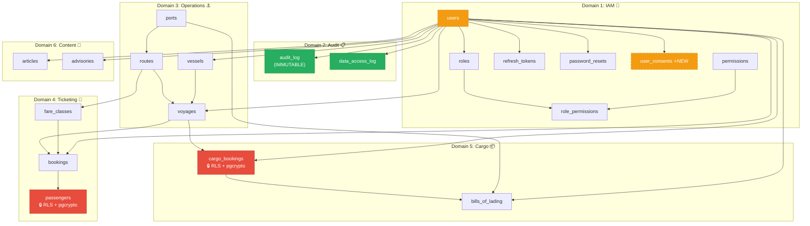
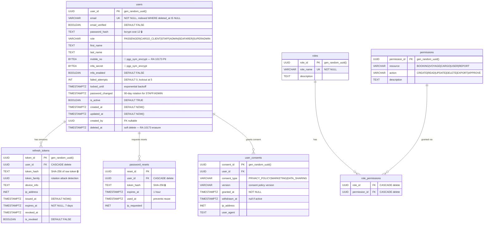
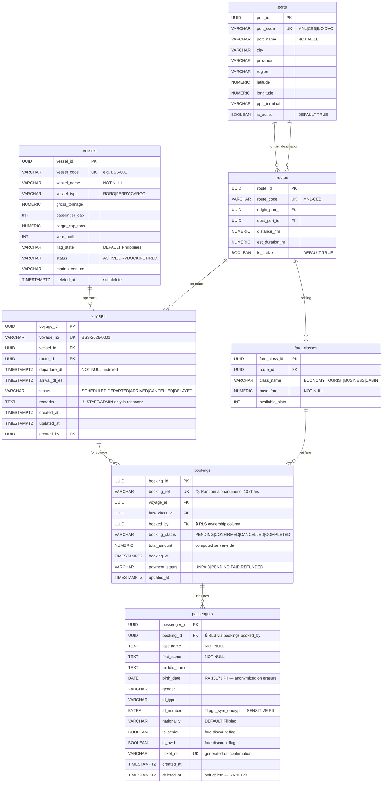
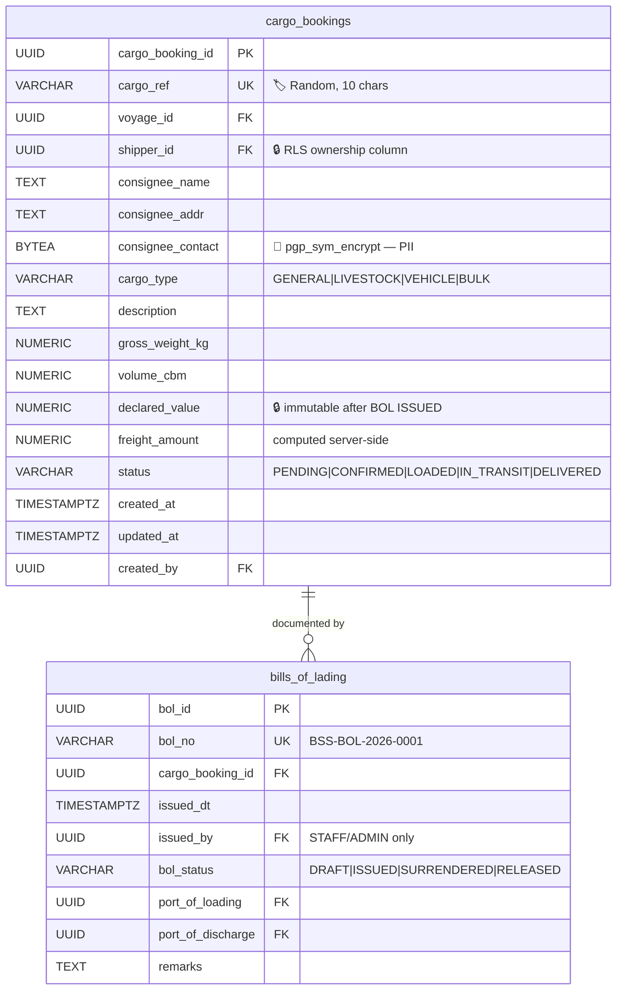
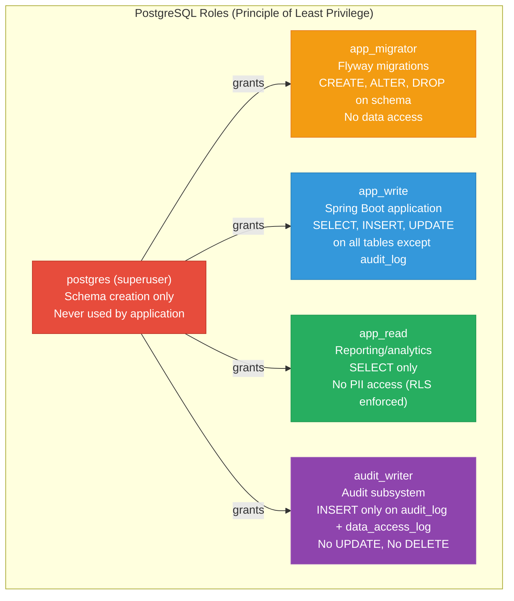

# Entity Relationship Diagram with Security Annotations

**Document:** Architecture Document — Section 9  

---

## 9. ERD — Full Schema with Security Annotations

### 9.1 Domain Map



**Legend:**  
🔴 Red = PII tables with RLS + pgcrypto encryption  
🟢 Green = Audit tables (immutable, INSERT-only)  
🟡 Yellow = Identity tables (credentials, sensitive)  
⭐ Dashed = New table identified during compliance analysis

---

### 9.2 Detailed ERD — Domain 1: Identity & Access Management



### 9.3 Detailed ERD — Domain 3-4: Operations & Ticketing



### 9.4 Detailed ERD — Domain 5: Cargo



---

### 9.5 Security Annotation Summary

| Table | RLS Enabled | Encrypted Columns | Audit Events | Soft Delete | RA 10173 Scope |
|-------|:-----------:|:-----------------:|:------------:|:-----------:|:--------------:|
| `users` | ❌ (app-level) | `mobile_no`, `mfa_secret` | LOGIN, REGISTER, LOCK, PASSWORD_CHANGE | ✅ | ✅ Personal Info |
| `passengers` | ✅ | `id_number` | BOOKING_CREATED, PII_ACCESSED | ✅ | ✅ Sensitive PI |
| `bookings` | ✅ | — | BOOKING_CREATED, CANCELLED | ❌ (via passengers) | ✅ (linked to PII) |
| `cargo_bookings` | ✅ | `consignee_contact` | CARGO_BOOKING_CREATED | ❌ | ✅ Personal Info |
| `bills_of_lading` | ❌ (via cargo) | — | BOL_ISSUED | ❌ | ❌ |
| `audit_log` | ❌ | — | N/A (is audit) | ❌ (immutable) | ✅ (contains IPs) |
| `data_access_log` | ❌ | — | N/A (is audit) | ❌ (immutable) | ✅ (RA 10173 §20) |
| `user_consents` | ❌ | — | CONSENT_GRANTED/WITHDRAWN | ❌ (never delete) | ✅ (§12 proof) |
| `refresh_tokens` | ❌ (app-level) | `token_hash` (SHA-256) | TOKEN_ROTATED, REUSE_DETECTED | ❌ (revoked flag) | ✅ (contains IP) |
| `vessels` | ❌ | — | VESSEL_CREATED/UPDATED | ✅ | ❌ |
| `voyages` | ❌ | — | VOYAGE_STATUS_UPDATED | ❌ | ❌ |
| `articles` | ❌ | — | ARTICLE_PUBLISHED | ✅ | ❌ |
| `advisories` | ❌ | — | ADVISORY_CREATED | ❌ | ❌ |

---

### 9.6 Database Role Separation



| DB Role | Permissions | Used By | Rationale |
|---------|------------|---------|-----------|
| `postgres` | Superuser | Initial setup only | Never used by application; credentials rotated post-setup |
| `app_migrator` | DDL (CREATE, ALTER, DROP) | Flyway in CI/CD pipeline | Separate from runtime; only active during deployments |
| `app_write` | DML (SELECT, INSERT, UPDATE) on all tables except `audit_log` | Spring Boot application | Primary application role; cannot modify audit trail |
| `app_read` | SELECT on non-PII views | Reporting dashboard, Grafana | Cannot see encrypted columns; RLS strips PII rows |
| `audit_writer` | INSERT only on `audit_log`, `data_access_log` | Audit subsystem (separate connection pool) | Immutability guarantee — even compromised app cannot alter audit history |

---

### 9.7 RLS Policy Details

```sql
-- Policy 1: Passengers can only read their own booking's passenger records
CREATE POLICY passenger_self ON passengers
  FOR SELECT
  USING (booking_id IN (
    SELECT booking_id FROM bookings
    WHERE booked_by = current_setting('app.current_user_id')::UUID
  ));

-- Policy 2: Staff/Admin bypass RLS for operational needs
CREATE POLICY staff_override ON passengers
  FOR ALL
  USING (current_setting('app.current_user_role') IN ('STAFF','ADMIN','SUPERADMIN'));

-- Policy 3: Bookings visible only to owner
CREATE POLICY booking_owner ON bookings
  FOR SELECT
  USING (booked_by = current_setting('app.current_user_id')::UUID);

-- Policy 4: Staff/Admin bypass on bookings
CREATE POLICY booking_staff ON bookings
  FOR ALL
  USING (current_setting('app.current_user_role') IN ('STAFF','ADMIN','SUPERADMIN'));

-- Policy 5: Cargo bookings visible only to shipper
CREATE POLICY cargo_owner ON cargo_bookings
  FOR SELECT
  USING (shipper_id = current_setting('app.current_user_id')::UUID);

-- Policy 6: Staff/Admin bypass on cargo
CREATE POLICY cargo_staff ON cargo_bookings
  FOR ALL
  USING (current_setting('app.current_user_role') IN ('STAFF','ADMIN','SUPERADMIN'));

-- Session variable injection (done by RlsContextFilter via JDBC):
-- SET LOCAL app.current_user_id = '<uuid>';
-- SET LOCAL app.current_user_role = '<role>';
-- SET LOCAL expires at end of transaction (safe with PgBouncer transaction mode)
```

> [!WARNING]
> **PgBouncer Compatibility:** `SET LOCAL` is transaction-scoped and safe with PgBouncer in transaction mode. However, `SET` (without LOCAL) would leak session state between pooled connections. The `RlsContextFilter` MUST use `SET LOCAL` exclusively. This is enforced by code review and integration test.
